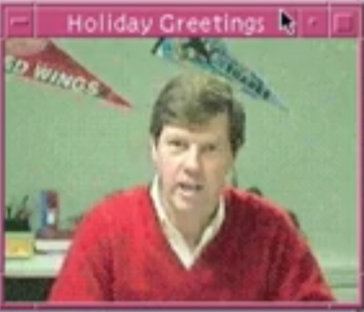

# holiday_greeting_1992
Sun Micro Systems - Scott McNealy , First Global Internet Stream December 1992. 

Video on youtube, 
https://youtu.be/IAYF-m1z7o4?si

I need a old copy of Solaris 2.4 or 2.5 on a SparkStation or emulator to capture an Mpeg4 of this. 

player will play TESTME or holliday greeting 1992 files out to local audio and standard Xwindow. 

Still looking for the source code for these. 

This should be a precursor to : Sun's CellB Video Encoding rfc2029

http://www.cs.columbia.edu/~hgs/rtp/drafts/draft-ietf-avt-cellb-06.txt

"CellB, derived from CellA, has been optimized for network-based video
applications.  It is computationally symmetric in both encode and
decode.  CellB utilizes a fixed colormap and vector quantization
techniques in the YUV color space to achieve compression."

I came in and implemented that change to there codec in a few days, and did the stream, I have no idea what happened to that code after I left my brief contract in 1992. 

John

